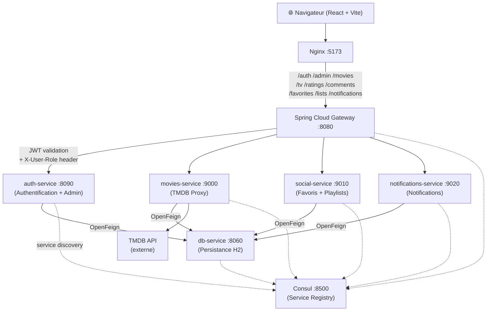

# Clap! — Plateforme de découverte cinéma

> Projet de titre professionnel **DWWM** (Développeur Web et Web Mobile) — 2025–2026  
> Réalisé par **Antonin Tacchi** · antonin.tacchi2005@gmail.com

---

## Table des matières

1. [Présentation](#présentation)
2. [Fonctionnalités](#fonctionnalités)
3. [Architecture](#architecture)
4. [Stack technique](#stack-technique)
5. [Démarrage rapide](#démarrage-rapide)
6. [Variables d'environnement](#variables-denvironnement)
7. [Tests](#tests)
8. [API & Documentation Swagger](#api--documentation-swagger)
9. [Accès admin](#accès-admin)
10. [Structure du projet](#structure-du-projet)

---

## Présentation

**Clap!** est une application web full-stack permettant de découvrir, noter et organiser des films et séries.  
Elle expose un catalogue complet basé sur l'API **TMDB**, offre un système de listes personnalisées, un moteur de découverte aléatoire par humeur, un profil utilisateur gamifié (badges, niveaux) et un panneau d'administration complet.

---

## Fonctionnalités

| Fonctionnalité | Description |
|---|---|
| 🎬 Catalogue | Recherche, filtrage par genre / année / langue / plateforme |
| 🎲 Découverte | Sélection aléatoire par humeur (action, comédie, horreur…) |
| ⭐ Notation & avis | Notes sur 10 et commentaires par média |
| 📋 Listes | Playlists personnalisées (publiques / privées) |
| 📰 Actualités | Sorties récentes et à venir depuis TMDB |
| 🔔 Notifications | Alertes de nouvelles sorties et badges débloqués |
| 👤 Profil | Badges, niveau XP, genres favoris, fond personnalisé |
| 🌐 Multi-langue | Interface disponible en Français et Anglais (i18next) |
| 🛡️ Administration | Dashboard, gestion utilisateurs / commentaires / ratings / logs |

---

## Architecture



### Flux d'authentification

```
POST /auth/login
  → Gateway (vérifie la route, passe sans JWT requis)
  → auth-service (vérifie credentials, génère JWT)
  → Réponse: { token, user }

Requêtes authentifiées :
  → Gateway extrait JWT → injecte X-User-Id + X-User-Role dans les headers
  → Microservice utilise ces headers sans re-décoder le JWT
```

---

## Stack technique

### Backend
| Technologie | Rôle |
|---|---|
| Java 17 | Langage backend |
| Spring Boot 3.5.x | Framework microservices |
| Spring Cloud Gateway | Point d'entrée unique + routage JWT |
| Spring Cloud OpenFeign | Communication inter-services |
| Consul (HashiCorp) | Service registry & discovery |
| H2 (file mode) | Base de données embarquée persistante |
| Flyway | Migration de schéma SQL |
| JWT (jjwt 0.12.x) | Authentification stateless |
| BCrypt | Hachage des mots de passe |
| springdoc-openapi 2.6 | Documentation Swagger UI |
| JUnit 5 + Mockito | Tests unitaires backend |

### Frontend
| Technologie | Rôle |
|---|---|
| React 18 | Interface utilisateur |
| Vite 5 | Bundler / dev server |
| Tailwind CSS 3 | Styling utilitaire |
| Framer Motion 11 | Animations |
| React Router 6 | Navigation SPA |
| TanStack Query 5 | Data fetching & cache |
| Zustand 4 | État global (auth) |
| Axios | Requêtes HTTP |
| i18next / react-i18next | Internationalisation FR/EN |
| Three.js / R3F | Effets 3D (page d'accueil) |
| Vitest + Testing Library | Tests unitaires frontend |

### Infrastructure
| Technologie | Rôle |
|---|---|
| Docker + Docker Compose | Conteneurisation |
| Nginx | Serveur frontend + proxy API |

---

## Démarrage rapide

### Prérequis

- [Docker Desktop](https://www.docker.com/products/docker-desktop/) ≥ 4.x
- Clé API TMDB (gratuite sur [themoviedb.org](https://www.themoviedb.org/settings/api))

### 1. Cloner le dépôt

```bash
git clone <url-du-repo>
cd DWWM_Project_Title
```

### 2. Configurer les variables d'environnement

Copier l'exemple et remplir les valeurs :

```bash
cp .env.example .env
```

Éditer `.env` :

```env
JWT_SECRET=votre_secret_jwt_base64_256bits
JWT_EXPIRATION=86400000
TMDB_API_KEY=votre_cle_tmdb
```

> **Générer un secret JWT sécurisé :**  
> `openssl rand -base64 32`

### 3. Lancer tous les services

```bash
docker compose up -d --build
```

L'ordre de démarrage est géré automatiquement par les `depends_on` + `healthchecks` :

```
Consul → db-service → auth-service / movies-service / social-service / notifications-service → gateway → frontend
```

### 4. Accéder à l'application

| Service | URL |
|---|---|
| **Application web** | http://localhost:5173 |
| **API Gateway** | http://localhost:8080 |
| **Swagger UI (auth)** | http://localhost:8090/swagger-ui/index.html |
| **Consul UI** | http://localhost:8500 |
| **db-service** (debug) | http://localhost:8060 |

### 5. Arrêter les services

```bash
docker compose down
```

Pour supprimer également le volume de base de données :

```bash
docker compose down -v
```

---

## Variables d'environnement

| Variable | Service(s) | Description |
|---|---|---|
| `JWT_SECRET` | auth-service, gateway | Secret Base64 pour signer/vérifier les JWT |
| `JWT_EXPIRATION` | auth-service | Durée de validité du token en millisecondes |
| `TMDB_API_KEY` | movies-service | Clé API The Movie Database |

---

## Tests

### Backend (JUnit 5 + Mockito)

```bash
# auth-service
cd Services/auth
./mvnw test

# db-service
cd Services/db-service
./mvnw test

# gateway
cd gateway
./mvnw test
```

**Couverture backend :**

| Service | Tests |
|---|---|
| auth-service | `JwtUtilTest` (6), `AuthServiceTest` (8), `AdminControllerTest` (4) |
| db-service | `CommentControllerTest` (5), `RatingControllerTest` (5) |
| gateway | `JwtUtilGatewayTest` (6) |

### Frontend (Vitest + Testing Library)

```bash
cd frontend
npm install
npm test               # exécution unique
npm run test:watch     # mode watch
npm run test:coverage  # rapport de couverture HTML
```

**Tests frontend :**

| Fichier | Couverture |
|---|---|
| `authStore.test.js` | login, logout, updateUser, extraction du rôle JWT |
| `NotFound.test.jsx` | Rendu, liens de navigation, traductions |

---

## API & Documentation Swagger

La documentation interactive Swagger UI est disponible sur l'**auth-service** :

```
http://localhost:8090/swagger-ui/index.html
```

Pour tester les endpoints protégés :
1. `POST /auth/login` → copier le `token` de la réponse
2. Cliquer **Authorize** → coller `Bearer <token>`
3. Tester les endpoints admin `/admin/**`

### Principales routes Gateway

| Méthode | Route | Service | Auth requise |
|---|---|---|---|
| `POST` | `/auth/register` | auth-service | Non |
| `POST` | `/auth/login` | auth-service | Non |
| `GET` | `/movies/popular` | movies-service | Non |
| `GET` | `/movies/{id}` | movies-service | Non |
| `GET` | `/tv/{id}` | movies-service | Non |
| `POST` | `/comments` | social-service | Oui |
| `POST` | `/favorites` | social-service | Oui |
| `POST` | `/lists` | social-service | Oui |
| `POST` | `/ratings` | social-service | Oui |
| `GET` | `/notifications` | notifications-service | Oui |
| `GET` | `/admin/**` | auth-service | Oui (admin) |

---

## Accès admin

1. **Créer un compte** via `/register`
2. **Promouvoir en admin** : modifier directement le rôle dans la BDD H2 ou via un compte admin existant

   Via l'API (nécessite un token admin existant) :
   ```bash
   curl -X PATCH http://localhost:8080/admin/users/{id}/role \
     -H "Authorization: Bearer <admin-token>" \
     -H "Content-Type: application/json" \
     -d '"admin"'
   ```

3. **Se connecter** → le bouton **Admin** apparaît dans la navbar
4. **Accéder au panneau** : http://localhost:5173/admin

### Fonctionnalités du panneau admin

- **Dashboard** : statistiques globales + graphiques + activité récente
- **Utilisateurs** : liste, promotion admin, suppression
- **Commentaires** : modération, suppression
- **Ratings** : consultation, suppression
- **Logs d'activité** : historique des actions admin avec filtres
- **Recherche globale** : recherche unifiée sur users / commentaires / ratings

---

## Structure du projet

```
DWWM_Project_Title/
├── docker-compose.yml
├── .env.example
├── README.md
│
├── frontend/                      # React + Vite + Tailwind
│   ├── src/
│   │   ├── components/
│   │   │   ├── layout/            # Navbar, Footer, ErrorBoundary, ProtectedRoute…
│   │   │   └── ui/                # NotificationToast, cards…
│   │   ├── pages/
│   │   │   ├── admin/             # AdminLayout, Dashboard, Users, Comments…
│   │   │   └── legal/             # LegalNotice, Terms, Privacy, Contact
│   │   ├── store/                 # Zustand (authStore)
│   │   ├── locales/               # en.json, fr.json (i18next)
│   │   └── tests/                 # Vitest test files
│   ├── nginx.conf                 # Config Nginx (SPA + proxy API)
│   └── vite.config.js
│
├── gateway/                       # Spring Cloud Gateway
│   └── src/main/java/…
│
└── Services/
    ├── auth/                      # Authentification + Administration
    │   └── src/
    │       ├── main/java/…
    │       └── test/java/…        # JwtUtilTest, AuthServiceTest, AdminControllerTest
    │
    ├── db-service/                # Persistance H2 (entités + repositories)
    │   └── src/
    │       ├── main/java/…
    │       └── test/java/…        # CommentControllerTest, RatingControllerTest
    │
    ├── movies/                    # Proxy TMDB API
    ├── social/                    # Favoris, playlists, commentaires, ratings
    └── notifications/             # Système de notifications
```

---

## Auteur

**Antonin Tacchi**  
Formation DWWM — 2025–2026  
✉️ antonin.tacchi2005@gmail.com

---

> *« Le cinéma, c'est l'écriture moderne dont l'encre est la lumière. »*  
> — Jean Cocteau
