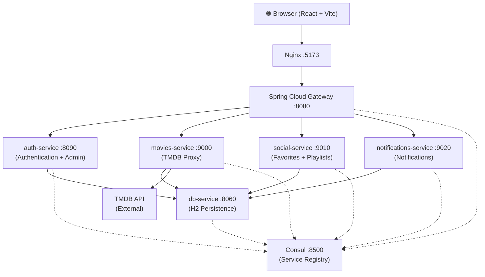

# 🎬 Clap! — Movie & TV Discovery Platform

> **DWWM Professional Certification Project (2025–2026)**
> Designed and developed by **Antonin Tacchi**

---

## Overview

**Clap!** is a full-stack movie and TV discovery platform built around a **microservices architecture**.

Powered by the **TMDB API**, the application allows users to discover movies and series, manage personal lists, rate and review content, receive notifications, and enjoy a gamified profile experience.

The project also includes a complete **administration panel** for moderation and platform management.

---

## ✨ Features

| Feature | Description |
|---|---|
| 🎬 Movie & TV Catalog | Search and browse movies and series powered by TMDB |
| 🔍 Advanced Filtering | Filter by genre, year, language, and platform |
| 🎲 Mood Discovery | Random discovery system based on mood or genre |
| ⭐ Ratings & Reviews | Rate media out of 10 and post comments |
| 📋 Custom Lists | Create and manage public or private playlists |
| 📰 Releases & News | Discover recent and upcoming releases |
| 🔔 Notifications | Alerts for releases and unlocked badges |
| 👤 Gamified Profiles | XP levels, badges, favorite genres, custom backgrounds |
| 🌐 Internationalization | French and English support using i18next |
| 🛡️ Admin Dashboard | User, comments, ratings, and logs management |

---

## 🏗️ Architecture



### Authentication Flow

```text
POST /auth/login
  → Gateway (public route)
  → auth-service (credential validation + JWT generation)
  → Response: { token, user }

Authenticated requests:
  → Gateway extracts JWT
  → Injects X-User-Id and X-User-Role headers
  → Services trust forwarded headers without decoding JWT again
```

---

## 🧰 Tech Stack

### Backend

| Technology | Purpose |
|---|---|
| Java 17 | Backend language |
| Spring Boot 3.5.x | Microservices framework |
| Spring Cloud Gateway | API gateway and JWT routing |
| Spring Cloud OpenFeign | Inter-service communication |
| Consul | Service registry and discovery |
| H2 Database | Embedded persistent database |
| Flyway | SQL schema migration |
| JWT (jjwt 0.12.x) | Stateless authentication |
| BCrypt | Password hashing |
| springdoc-openapi | Swagger documentation |
| JUnit 5 + Mockito | Unit testing |

### Frontend

| Technology | Purpose |
|---|---|
| React 18 | User interface |
| Vite 5 | Development server and bundler |
| Tailwind CSS 3 | Utility-first styling |
| Framer Motion 11 | Animations |
| React Router 6 | SPA navigation |
| TanStack Query 5 | Data fetching and caching |
| Zustand 4 | Global auth state |
| Axios | HTTP requests |
| i18next | Internationalization |
| Three.js / React Three Fiber | 3D homepage effects |
| Vitest + Testing Library | Frontend testing |

### Infrastructure

| Technology | Purpose |
|---|---|
| Docker + Docker Compose | Containerization |
| Nginx | Frontend serving and API proxy |

---

## 🚀 Getting Started

### Prerequisites

- Docker Desktop ≥ 4.x
- TMDB API Key (free at https://www.themoviedb.org/settings/api)

### 1. Clone the Repository

```bash
git clone https://github.com/antonin-tacchi/DWWM_Project_Title.git
cd DWWM_Project_Title
```

### 2. Configure Environment Variables

Create your environment file:

```bash
cp .env.example .env
```

Edit `.env`:

```env
JWT_SECRET=your_256bit_base64_secret
JWT_EXPIRATION=86400000
TMDB_API_KEY=your_tmdb_api_key
```

Generate a secure JWT secret:

```bash
openssl rand -base64 32
```

### 3. Launch the Platform

```bash
docker compose up -d --build
```

Startup order is handled automatically through health checks and dependencies:

```text
Consul
→ db-service
→ auth / movies / social / notifications
→ gateway
→ frontend
```

### 4. Access Services

| Service | URL |
|---|---|
| Web Application | http://localhost:5173 |
| API Gateway | http://localhost:8080 |
| Swagger UI | http://localhost:8090/swagger-ui/index.html |
| Consul UI | http://localhost:8500 |
| db-service (debug) | http://localhost:8060 |

### 5. Stop Services

```bash
docker compose down
```

Remove database volumes as well:

```bash
docker compose down -v
```

---

## 🔐 Environment Variables

| Variable | Service | Description |
|---|---|---|
| `JWT_SECRET` | auth-service, gateway | Base64 JWT signing secret |
| `JWT_EXPIRATION` | auth-service | Token validity in milliseconds |
| `TMDB_API_KEY` | movies-service | TMDB API key |

---

## 🧪 Testing

### Backend Tests

```bash
# auth-service
cd Services/auth
./mvnw test

# db-service
cd Services/db-service
./mvnw test

# gateway
cd gateway
./mvnw test
```

Current backend coverage includes:

- JwtUtilTest
- AuthServiceTest
- AdminControllerTest
- CommentControllerTest
- RatingControllerTest
- JwtUtilGatewayTest

### Frontend Tests

```bash
cd frontend
npm install
npm test
npm run test:watch
npm run test:coverage
```

Frontend coverage currently includes:

- authStore tests
- NotFound page tests

---

## 📚 API Documentation

Swagger UI is available through the authentication service:

```text
http://localhost:8090/swagger-ui/index.html
```

### Testing Protected Endpoints

1. `POST /auth/login`
2. Copy the returned JWT token
3. Open **Authorize** in Swagger
4. Paste:

```text
Bearer <token>
```

### Main Gateway Routes

| Method | Route | Service | Auth |
|---|---|---|---|
| POST | `/auth/register` | auth-service | No |
| POST | `/auth/login` | auth-service | No |
| GET | `/movies/popular` | movies-service | No |
| GET | `/movies/{id}` | movies-service | No |
| GET | `/tv/{id}` | movies-service | No |
| POST | `/comments` | social-service | Yes |
| POST | `/favorites` | social-service | Yes |
| POST | `/lists` | social-service | Yes |
| POST | `/ratings` | social-service | Yes |
| GET | `/notifications` | notifications-service | Yes |
| GET | `/admin/**` | auth-service | Admin |

---

## 🛡️ Administration

### Promote a User to Admin

You can either:

- Modify the role directly inside the H2 database
- Use an existing administrator account

Example:

```bash
curl -X PATCH http://localhost:8080/admin/users/{id}/role \
-H "Authorization: Bearer <admin-token>" \
-H "Content-Type: application/json" \
-d '"admin"'
```

Once authenticated as admin, the **Admin** button becomes available in the navigation bar.

Admin panel:

```text
http://localhost:5173/admin
```

### Admin Features

- Dashboard and statistics
- User management
- Comment moderation
- Ratings management
- Admin activity logs
- Unified search system

---

## 📁 Project Structure

```text
DWWM_Project_Title/
├── docker-compose.yml
├── .env.example
├── frontend/
├── gateway/
└── Services/
    ├── auth/
    ├── db-service/
    ├── movies/
    ├── social/
    └── notifications/
```

---

## 👨‍💻 Author

**Antonin Tacchi**
DWWM Training Program — 2025–2026
Email: antonin.tacchi2005@gmail.com

---

> "Cinema is the modern writing whose ink is light."
> — Jean Cocteau